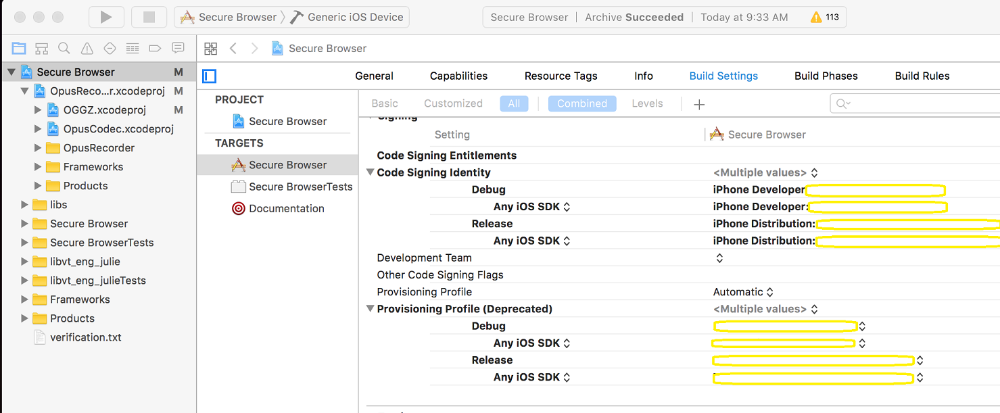
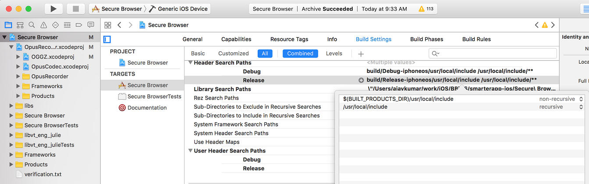

# Building Secure Browser for iOS

## System and Build prerequisites:

* This build was tested with macOS version 10.12.5 and Xcode version 8.3.3.
* Install git version control.
* A valid iOS Development Provisioning Profile is needed for building the app on Xcode. This profile contains:
      1. iOS developer certificate
      1. App ID: org.xxx.xxxxx. An App ID is used to uniquely identify an app submitted to the app store or installed on an iOS device
      1. List of Devices: this includes all devices that we would like to side load the app to for testing purposes
* A valid iOS Distribution Provisioning Profile for internal app distribution, which contains:
      1. iOS production certificate
      1. App ID: org.xxx.xxxxx
      1. List of Devices: this includes all devices that you would like to distribute the app for internal testing purposes. Devices not on the list are not allowed to download and install the iOS browser app.
* A valid iOS Distribution Provisioning Profile for app store submission, which contains:
      1. iOS production certificate (same one used in internal distribution provisioning profile)
      1. App ID: org.xxx.xxxxx

## Build Process:
* Install developer and production certificate on the Mac:
      1. Log in to Apple iOS Dev Center, then chose **Certificates, Identifier & Profiles** to access the provisioning portal
      1. Download an iOS Development certificate. Choose **Certificates** -> **Development** from the left panel, and select the developer certificate from the list, and press download, the certificate will be download to the Mac.
      1. Follow similar steps to download an iOS Production certificate. Search for the list of production certificate from **Certificates** -> **Production**, and download your production certificate.
      1. If downloads are successful, there will be two .cer files in your download location of the Mac. Double click each of the two files to install the certificates on the Mac. Run **Keychain Access** application to make sure that the two certificates are in fact installed on the Mac (the certificates should be visible after you press "my certificates" in Keychain Access)
* Install the Development and Distribution profiles on the Mac:
      1. Go to the iOS provisioning portal again, and press **Provisioning Profiles** -> **Development** from the left panel, then choose your development profile. Press the Download button to download the profile.
      1. Follow similar steps to download the two distribution profiles. Press **Provisioning Profiles** -> **Distribution** to retrieve a list of distribution profiles and download both profiles.
      1. Open Xcode on the Mac, and double click each of the three profiles downloaded in the previous steps to install them in Xcode
* Check out the iOS Secure Browser project. The source code is available at: https://bitbucket.org/sbacoss/smarterapp-ios
* Load the iOS project into Xcode: Open Finder on Mac and go to the folder in which the project was checked out in the previous step. There is a file named **Secure Browser.xcodeproj**, which is the main project file. Double click this file to load the project to Xcode.
* Set the correct code signing identity needed for building and distributing the project: Check the figure below for reference.
      1. In Xcode, open the project and then select **Project** -> **Secure Browser** to the right of the main project panel. Next, press **Build Settings** tab on the top and scroll down to find a section called **code signing identity**. This is where you need to set the developer certificate. Choose the proper developer certificate from the list for all entries.
      1. In Xcode, open the project and then select **Targets** -> **Secure Browser** to the right of the main project panel. Next, press **Build Settings** tab on the top and scroll down to find a section called **code signing identity**. This is where we set the developer and production certificates for the project. Choose developer certificate for Debug category and production for Release category

	

* Configure User Header Files Path:
      1. Extract the iOSHeaderFiles.tar file and place under **/usr/local/include/**
      1. On the Xcode project panel explore the **secure Browser** project folder, and as well explore the **OpusRecorder.xcodeproj** project folder
      1. Select **Targets** -> **Secure Browser** to the right of the main project panel. Next, press the "Build Settings" tab on the top and scroll down to find a section **Search paths**. For subsections **Header Search Paths** and **User Header Search Paths** add "/usr/local/include" with recursive for both debug and release
      1. Select **OpusRecorder.xcodeproj**, then press Build settings. Scroll down to find **Header Search Paths** under Search paths section. For debug and release add headers files path with recursive.
      1. Select **OGGZ.xcodeproj** on project panel, then press Build settings. Scroll down and find **User Header Search Paths** under Search paths section. For debug and release add headers files path with recursive

	

* Build the iOS Secure Browser project and run the app:
      1. There are two options to run the browser app, either running on iPad simulator, or an actual iPad. Make the selection for the running environment from the dropdown list which is to the right of the "play" and "stop" buttons on the UI.
      1. To run the browser on an iPad, you need to side load the app to the iPad. To do this, connect an iPad to the Mac, having made sure the iPad is on the device list of the provisioning profile. Otherwise, the iOS browser cannot be installed on the iPad.
      1. Choose **Product** -> **Run** from the menu to run the project on either iPad simulator or an iPad device. Make sure that there are no build errors.

* Create the ipa file for app distribution:
      1. If the app runs properly, you are now ready to distribute the app for internal test. Create an ipa file so that it can be upload to TestFlight for distribution.
      1. To create the ipa file, choose **Product** -> **Archive** from the top menu and follow the prompts. 
      1. If the above step is successful, a new archive will be created, and shown on the list of archives. Select this archive and press the "export" button, **select a method of export** depending on your distribution requirement. For Internal distribution select "Save for Ad Hoc Deployment" to create the ipa file and click on next and follow the prompts. Select the folder for export and export ipa there.